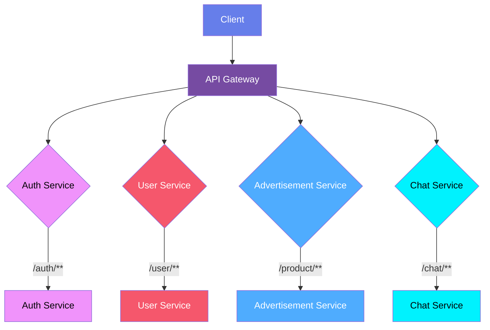

# EveryBuy API Gateway

This project serves as the API Gateway for EveryBuy, providing routing and filtering for backend microservices including authentication, user management, advertisement, chat services.

## Architecture Diagram

## Deployment URL

http://api-everybuy.onrender.com 

## Open Api Documentation

https://app.swaggerhub.com/apis-docs/OlesiaSmahlii/EveryBuy/1.0#/

## Routes and Services

The API Gateway currently routes requests to the following services:

- **auth-service**: 
  - *Routes requests* with path `/auth/**`
  - *Features:* JWT token generation; User authentication
  
- **user-service**: 
  - *Routes* requests with path `/user/**`
  - *Features:* User profile management
  - 
- **advertisement-service**: 
  - *Routes* requests with path `/product/**`
  - *Features:* Product listings
  
- **chat-service**: 
  - *Routes* requests with path `/chat/**`
  - *Features:* Messaging

